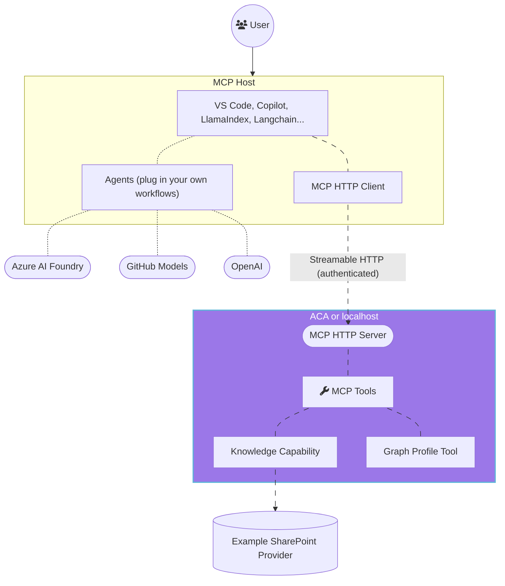
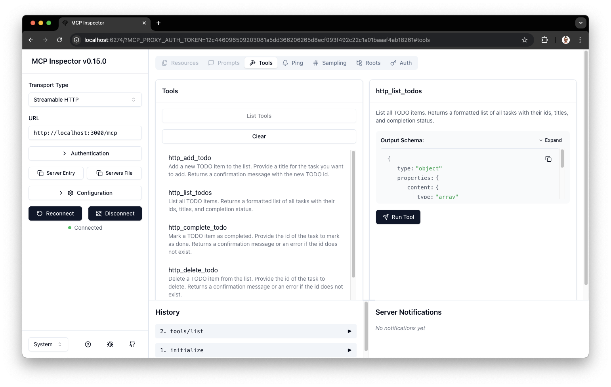

<!--
---
name: Remote MCP with Azure Container Apps (Node.js/TypeScript/JavaScript)
description: Run a remote node.js MCP server on Azure Container Apps.  
languages:
- typescript
- javascript
- nodejs
- bicep
- azdeveloper
products:
- azure-container-apps
- azure
urlFragment: secure-mcp-gateway
---
-->
# Secure MCP Gateway Template (Node.js/TypeScript)


[](https://www.typescriptlang.org)

This repository is a reusable template for building a secure remote Model Context Protocol (MCP) gateway on Azure Container Apps. It is built with Node.js and TypeScript and implements the core patterns from the Azure Container Apps + Entra OAuth 2.1 architecture: RFC 9728 protected resource metadata, JWT validation through JWKS, request-scoped authorization, and On-Behalf-Of flow for downstream Microsoft Graph access.

> [!WARNING]
> This repository is intended as a starting point, not a finished product. Your production implementation will likely need different tools, content connectors, permission boundaries, and operational controls. Always conduct a security audit and threat modeling for any production and customer-facing assets that require authentication and authorization.

If you are onboarding to this repository, start with [docs/onboarding.md](docs/onboarding.md) for the current architecture, request flow, and extension points.

## Attribution

This project began as an adaptation of the Microsoft `Azure-Samples/mcp-container-ts` repository and has since been substantially refactored for this secure MCP gateway template and its target use cases.

- Original source: https://github.com/Azure-Samples/mcp-container-ts
- Current repository: https://github.com/aslammarikkar/secure-mcp-gateway.git
- See [NOTICE.md](NOTICE.md) for attribution details.

## Repository Ownership

This repository is intended to be customized for your own team and environment.

- Replace placeholder repository URLs and directory names with your internal repo details.
- Replace tool implementations and permission mappings with the capabilities your agents actually need.
- Keep the auth, OBO, and MCP request flow intact unless you are intentionally changing the security model.

## What This Template Gives You

- A remote MCP HTTP endpoint secured by Microsoft Entra bearer tokens.
- RFC 9728 protected resource metadata for MCP client discovery.
- Request-scoped authorization and permission-aware tool exposure.
- Secretless On-Behalf-Of flow for downstream Microsoft Graph access in Azure.
- A capability-oriented example tool set with one SharePoint-shaped provider seam you can replace with your own domain integrations.

## Template Adoption Checklist

Use this checklist when turning the template into a real project:

1. Rename the service and deployment identifiers to match your product or internal platform naming.
2. Replace the example knowledge provider and tools with your real protected tools, content connectors, or downstream APIs.
3. Tighten the permission model in `src/auth/authorization.ts` so agent capabilities match your actual access boundaries.
4. Update Entra app registration settings, scopes, pre-authorized clients, and managed identity wiring for your environment.
5. Set the correct `RESOURCE_SERVER_URL` and deployment environment values for local and Azure use.
6. Review telemetry names, rate limits, timeout policy, and logging defaults before production deployment.
7. Extend the regression suite before adding new tools so auth and permission behavior stays protected during customization.
8. Validate the protected resource metadata and authenticated `/mcp` path end to end after any auth or infra change.


## What is MCP?
The Model Context Protocol (MCP) is an open protocol that allows Large Language Models (LLMs) to interact with external tools and services in a standardized way. MCP enables LLMs to access and utilize various resources, such as databases, APIs, and other services, to enhance their capabilities and provide more accurate and relevant responses.

Below is the architecture diagram for a typical MCP server setup:



## Why use Azure Container Apps?
Azure Container Apps is a fully managed, serverless container platform that simplifies the deployment and operation of containerized applications. ACA also provides serverless GPU support, so that you can bring your own containers and deploy them to GPU-backed environments that automatically scale based on demand.

Key benefits:
- Autoscaling – scale to zero when idle, scale out with usage
- Pay-per-second billing – pay only for the compute you use
- Ease of use - accelerate developer velocity and easily bring any container and run it on GPUs in the cloud
- No infrastructure management – focus on your model and app
- Enterprise-grade features – out of the box support for bringing your own virtual networks, managed identity, private endpoints and more with full data governance

## Prerequisites

1. Install the latest version of [VS Code](https://code.visualstudio.com/)
2. Install [GitHub Copilot](https://marketplace.visualstudio.com/items?itemName=GitHub.copilot) and [GitHub Copilot Chat](https://marketplace.visualstudio.com/items?itemName=GitHub.copilot-chat) extensions

## Running the MCP Server Locally

If you prefer to run the MCP server locally, you can do so by following these steps.

You need to have the following tools installed on your local machine:
- [git](https://git-scm.com/downloads) necessary to clone the repository.
- [Node.js](https://nodejs.org/en/download/) and npm.

Once you have the prerequisites installed, you can follow these steps to run the MCP server locally:

1. Clone your repository:

```bash
git clone https://github.com/aslammarikkar/secure-mcp-gateway.git
cd secure-mcp-gateway
```

2. Install project dependencies

```bash
npm install
```

3. Configure the OAuth settings in your local `.env` file:

```bash
TENANT_ID=<your-tenant-id>
MCP_RESOURCE_APP_ID=<your-mcp-api-app-client-id>
RESOURCE_SERVER_URL=http://localhost:3000
MCP_SCOPE=access_as_user
SHAREPOINT_PROVIDER_MODE=sample
```

> [!NOTE]
> The local server validates Microsoft Entra access tokens directly. The old generated JWT path is no longer part of this template.

> [!NOTE]
> The SharePoint provider defaults to live Microsoft Graph retrieval. Set `SHAREPOINT_PROVIDER_MODE=sample` when you want deterministic local template behavior before wiring real SharePoint delegated permissions.

4. Acquire a token for local testing:

```bash
az login
az account get-access-token --resource api://<your-mcp-api-app-client-id> --query accessToken -o tsv
```

5. Start the dev server

```bash
npm run dev
```

You should see the following output in the terminal:

```bash
  mcp:db 2025-07-23T16:48:05.381Z PRAGMA journal_mode = WAL +0ms
  mcp:db 2025-07-23T16:48:05.382Z CREATE TABLE IF NOT EXISTS todos (
  mcp:db      id INTEGER PRIMARY KEY AUTOINCREMENT,
  mcp:db      text TEXT NOT NULL,
  mcp:db      completed INTEGER NOT NULL DEFAULT 0
  mcp:db    ) +0ms
  mcp:db 2025-07-23T16:48:05.382Z Database "todos" initialized. +0ms
  mcp:index 2025-07-23T16:48:05.449Z MCP Stateless Streamable HTTP Server +0ms
  mcp:index 2025-07-23T16:48:05.449Z MCP endpoint: http://localhost:3000/mcp +0ms
  mcp:index 2025-07-23T16:48:05.449Z Press Ctrl+C to stop the server +0ms
```

6. To access and use the MCP server, read the [Use your MCP server](#use-your-mcp-server) section below.

<br>

> [!NOTE]
> When the applications starts, the server will create an [in-memory SQLite](https://www.sqlite.org/inmemorydb.html) database. This database is used to store the state of the tools and their interactions with the MCP server.
>

> [!IMPORTANT]
> The `get_my_profile` tool uses secretless On-Behalf-Of flow through a managed identity. That path is intended for the Azure Container Apps deployment and won't work in plain local development unless you implement an alternate local credential flow.

## Deploying the MCP Server to Azure Container Apps

To deploy the MCP server to Azure Container Apps, you can use the Azure Developer CLI (azd). This will allow you to provision and deploy the project to Azure with minimal effort:

- Install the [Azure Developer CLI](https://learn.microsoft.com/azure/developer/azure-developer-cli/install-azd).

Once you have the prerequisites installed, you can follow these steps to deploy the MCP server to Azure Container Apps:

1. Clone your repository

```bash
git clone https://github.com/aslammarikkar/secure-mcp-gateway.git
cd secure-mcp-gateway
```

2. Log in to your Azure account

```bash
azd auth login
```

For GitHub Codespaces users, if the previous command fails, try:

```bash
azd auth login --use-device-code
```

1. Provision and deploy the project (ensure you are in the folder of the cloned repo when running this command):

```bash
azd up
```

4. Once the deployment is complete, you can access the MCP server using the URL provided in the output. The URL will look something like this:

```bash
https://<env-name>.<container-id>.<region>.azurecontainerapps.io
```

5. To access and use the MCP server, read the [Use your MCP server](#use-your-mcp-server) section below.

6. If you want to use the `get_my_profile` tool, configure your Entra app registration to trust the Container App managed identity through a federated credential and grant Microsoft Graph delegated permission such as `User.Read`.


> [!NOTE]
> If you were simply testing the deployment, you can remove and clean up all deployed resources by running the following command to avoid incurring any costs:
> ```bash
> azd down --purge --force
> ```


## Use your MCP server

### Option 0 - Use the provided client example

This repository includes a minimal example showing how to connect to the MCP gateway from an OpenAI-based client. Use it as a reference implementation, not as a required runtime component. The example lives in the `[examples/](./examples/)` directory.

### Option 1 - Use the mcp.json file in VS Code

The quickest way to connect to the MCP server is the use the provided `.vscode/mcp.json` configuration file to set up the MCP server in your VS Code environment. This configuration file contains the necessary settings for the MCP server, including the URL and transport type.

```json
{
  "inputs": [
    {
      "password": true,
      "id": "mcp-server-token",
      "description": "Enter the token for the MCP server",
      "type": "promptString",
    }
  ],
  "servers": {
    "mcp-server": {
      "type": "http",
      "url": "http://localhost:3000/mcp",
      "headers": {
        "Authorization": "Bearer ${input:mcp-server-token}"
      }
    },
    "mcp-server-remote": {
      "type": "http",
      "url": "https://<env-name>.<container-id>.<region>.azurecontainerapps.io/mcp",
      "headers": {
        "Authorization": "Bearer ${input:mcp-server-token}"
      }
    }
  }
}
```

Once you have this file opened, you can click on the "start" inlined action button that will connect the MCP server and fetch the available tools.

**IMPORTANT:** The server expects a Bearer access token for your MCP API app registration. For Entra-protected deployments, acquire one with Azure CLI:

```bash
az login
az account get-access-token --resource api://<your-mcp-api-app-client-id> --query accessToken -o tsv
```

> [!NOTE]
> Remote MCP requests should send `Accept: application/json, text/event-stream`. When invoking the endpoint manually, also send `mcp-protocol-version: 2025-06-18`.


### Option 2 - Manually Adding MCP Server to VS Code

1. Add MCP Server from command palette and add URL to your running server's HTTP endpoint:

For local development, the URL will be:
```bash
http://localhost:3000/mcp
```

For Azure Container Apps, the URL will be:
```bash
https://<env-name>.<container-id>.<region>.azurecontainerapps.io/mcp
```

1. Select **HTTP (HTTP or Server-Sent Events)** for the type of MCP server to add.
2. Enter the URL to your running HTTP endpoint, including the `/mcp` path at the end.
3. Enter the server ID. (This can be any name you want)
4. Choose if you want to run this in your User settings (available to all apps for you) or to your Workspace settings (available to this app, only)
5. In Copilot chat agent mode enter a prompt to trigger the tool, e.g., select some code and enter this prompt

```bash
I need to send an email to Dan, please add that to my todo list.
```
7. When prompted to run the tool, consent by clicking Continue,
8. When you're done, press Ctrl+C in the terminal window to stop the func.exe host process, and List MCP Servers from command palette and stop the local server.


### Option 3 - MCP Inspector

1. In a new terminal window, install and run [MCP Inspector](https://modelcontextprotocol.io/docs/tools/inspector)

```bash
npm run inspect
```

1. CTRL click to load the MCP Inspector web app from the URL displayed in the terminal (e.g. http://localhost:6274/?MCP_PROXY_AUTH_TOKEN=xyz)
2. Set the transport type to `Streamable HTTP`.
3. Add the authentication header `Authorization: Bearer <access-token>` using an Entra access token for your MCP API app registration.
4. Set the URL to your running server's HTTP endpoint and Connect:
```bash
# for local development, use:
http://localhost:3000/mcp

# or use the Azure Container Apps URL:
https://<env-name>.<container-id>.<region>.azurecontainerapps.io/mcp
```
5. List Tools. Click on a tool and Run Tool.



## Next Steps

- Learn more about [Model Context Protocol](https://modelcontextprotocol.io/)
- Learn more about [Azure Container Apps](https://learn.microsoft.com/en-us/azure/container-apps/)
- Learn more about [Azure AI Foundry](https://ai.azure.com)
- Learn more about the [Model Context Protocol](https://modelcontextprotocol.io/)

## Template Customization

Most teams will want to change these areas first:

- Replace the TODO tools with domain-specific tools or protected content connectors.
- Tighten permissions in `src/auth/authorization.ts` to match your actual agent capabilities.
- Update telemetry, deployment names, and environment defaults for your organization.
- Extend the regression tests before adding new protected tools or downstream APIs.